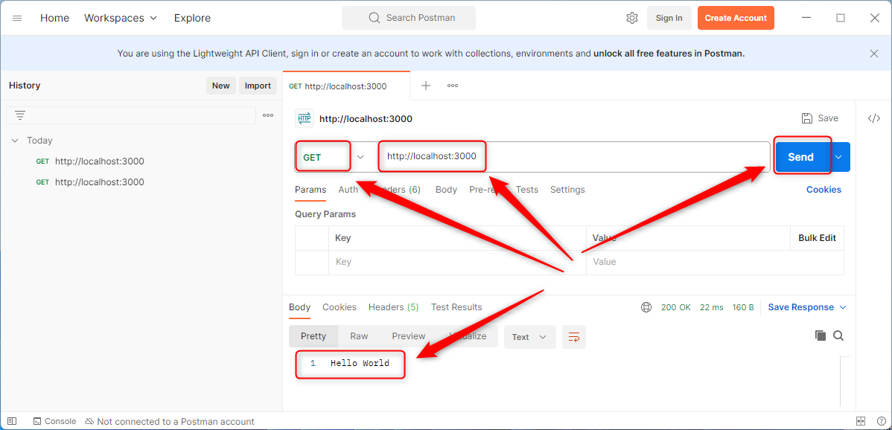
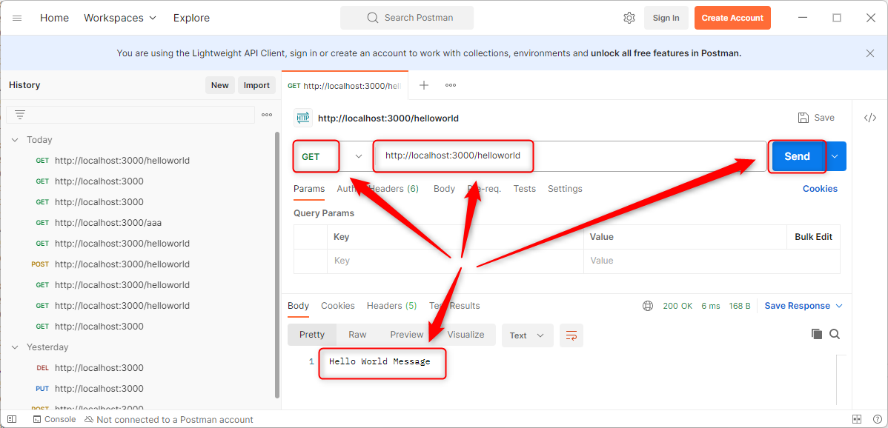
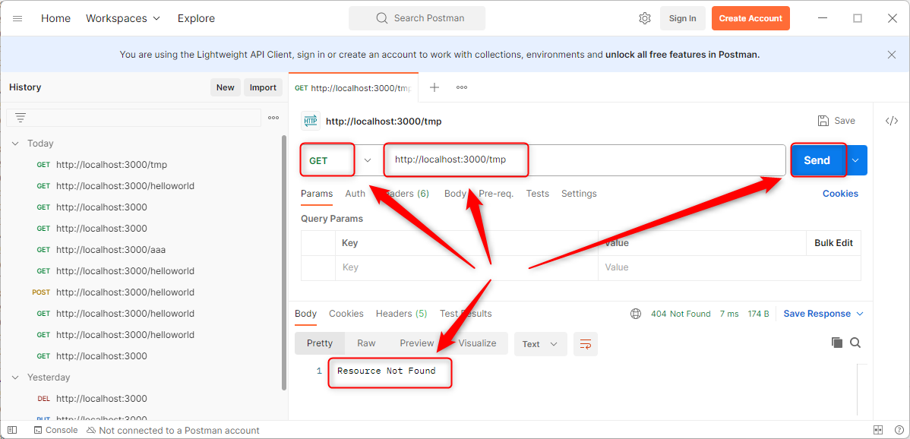

USAGE COMMANDS
--------------

> Please be aware that following tools should be installed in advance on your computer: **node.js**. 

> Please **clone/download** project, open **project's main folder** in your favorite **command line tool** and then **proceed with steps below**. 

Usage steps:
1. In a command line tool install nmp packages with `npm install`
1. In a command line tool start application with `npm start`
1. In a http client (e.g. Postman) use **GET** method and visit `http://localhost:3000`
   * Expected message **Hello World Index**
1. In a http client (e.g. Postman) use **GET** method and visit `http://localhost:3000/helloworld`
   * Expected message **Hello World Message**
1. In a http client (e.g. Postman) use **GET** method and visit `http://localhost:3000/tmp`
   * Expected message **Resource Not Found**
1. Clean up environment 
     * In a command line tool stop application with `ctrl + C`

USAGE IMAGES
------------

DESCRIPTION
-----------

##### Goal
The goal of this project is to present how to create an application type **API REST** in **TypeScript** programming language with usage **express** framework. This application consists of **multiple** API endpoints: endpoint **index** and endpoint **helloworld**.

##### Terminology
Terminology explanation:
* **TypeScript**: TypeScript is JavaScript with syntax for types.
* **API REST**: an architectural style for an application program interface (API) that uses HTTP requests to access and use data
* **Express framework**: Express.js is the most popular web framework for Node.js. It is designed for building web applications and APIs and has been called the de facto standard server framework for Node.js.

##### Flow
The following flow takes place in this project:
1. User via any http client sends request to application for the content.
1. Application sends back response to user via http client with message.

##### Launch
To launch this application please make sure that the **Preconditions** are met and then follow instructions from **Usage** section.

##### Technologies
This project uses following technologies:
* **TypeScript**: `https://docs.google.com/document/d/1uSQvYyzzBnsWEbkcsSoJlK-LfTwHAvh1r2rPP0p2P78/edit?usp=sharing`
* **Node** (section 'Node'): `https://docs.google.com/document/d/1wtk8TTIDLsHSvtyUp7uCk-pOKTpmNwMANRGmBNaoBpc/edit?usp=sharing`
* **Npm** (section 'Npm'): `https://docs.google.com/document/d/1wtk8TTIDLsHSvtyUp7uCk-pOKTpmNwMANRGmBNaoBpc/edit?usp=sharing`
* **Express framework** (section 'Express Framework'): `https://docs.google.com/document/d/1wtk8TTIDLsHSvtyUp7uCk-pOKTpmNwMANRGmBNaoBpc/edit?usp=sharing`

PRECONDITIONS
-------------

##### Preconditions - Tools
* Installed **Operating System** (tested on Windows 11)
* Installed **Node** (tested on version 18.18.1)

##### Preconditions - Actions
* Download **Source Code** (using Git or in any other way) 
* Open any **Command Line** tool (for instance "Windonw PowerShell" on Windows OS) on downloaded **project's main folder**