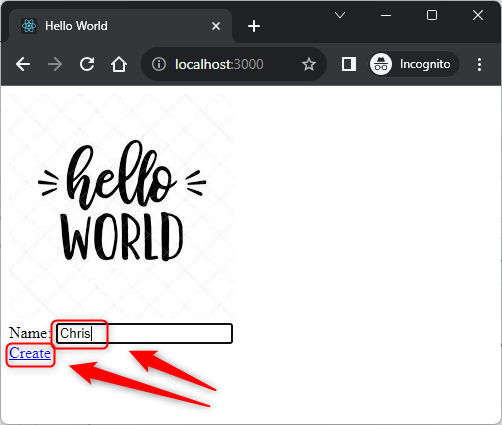

USAGE COMMANDS
--------------

> Please be aware that following tools should be installed in advance on your computer: **node.js**. 

> Please **clone/download** project, open **project's main folder** in your favorite **command line tool** and then **proceed with steps below**. 

Usage steps:
1. In a command line tool install nmp packages with `npm install`
1. In a command line tool start application with `npm start`
1. In a http browser (e.g. Chrome) visit `http://localhost:3000`
   * Expected **Hello World** page with "Name" field
1. In a http browser (e.g. Chrome) fill **name** (e.g. Chris) and click **Create** link
   * Expected message **Hello World Chris!**
1. In a http browser (e.g. Chrome) click **Back** link
   * Expected message **Hello World** page with "Name" field
1. Clean up environment 
     * In a command line tool stop application with `ctrl + C`

USAGE IMAGES
------------

DESCRIPTION
-----------

##### Goal
The goal of this project is to present how to create an **example** application type **GUI HTML** in **TypeScript** programming language with usage **express** framework and **ejs** template engine. This application consists of HTML page which includes following frontend elements: **html**, **javascript**, **css** and **images**.

##### Terminology
Terminology explanation:
* **TypeScript**: TypeScript is JavaScript with syntax for types.
* **GUI HTML**: it's an abbreviation for Graphical User Interface. It enables user to interact with application. GUI HTML means that user interacts with application via html web pag.
* **Express framework**: Express.js is the most popular web framework for Node.js. It is designed for building web applications and APIs and has been called the de facto standard server framework for Node.js.
* **Ejs**: Ejs is template engine that lets you generate HTML markup with plain JavaScript. In other words it generates HTML pages on server side so you can fill this page with data on server side instead of client side.

##### Flow
The following flow takes place in this project:
1. User via any html browser sends request to application for the content.
1. Application sends back response to user via html browser with message

##### Launch
To launch this application please make sure that the **Preconditions** are met and then follow instructions from **Usage** section.

##### Technologies
This project uses following technologies:
* **TypeScript**: `https://docs.google.com/document/d/1uSQvYyzzBnsWEbkcsSoJlK-LfTwHAvh1r2rPP0p2P78/edit?usp=sharing`
* **Node** (section 'Node'): `https://docs.google.com/document/d/1wtk8TTIDLsHSvtyUp7uCk-pOKTpmNwMANRGmBNaoBpc/edit?usp=sharing`
* **Npm** (section 'Npm'): `https://docs.google.com/document/d/1wtk8TTIDLsHSvtyUp7uCk-pOKTpmNwMANRGmBNaoBpc/edit?usp=sharing`
* **Express framework** (section 'Express Framework'): `https://docs.google.com/document/d/1wtk8TTIDLsHSvtyUp7uCk-pOKTpmNwMANRGmBNaoBpc/edit?usp=sharing`

PRECONDITIONS
-------------

##### Preconditions - Tools
* Installed **Operating System** (tested on Windows 11)
* Installed **Node** (tested on version 18.18.1)

##### Preconditions - Actions
* Download **Source Code** (using Git or in any other way) 
* Open any **Command Line** tool (for instance "Windonw PowerShell" on Windows OS) on downloaded **project's main folder**