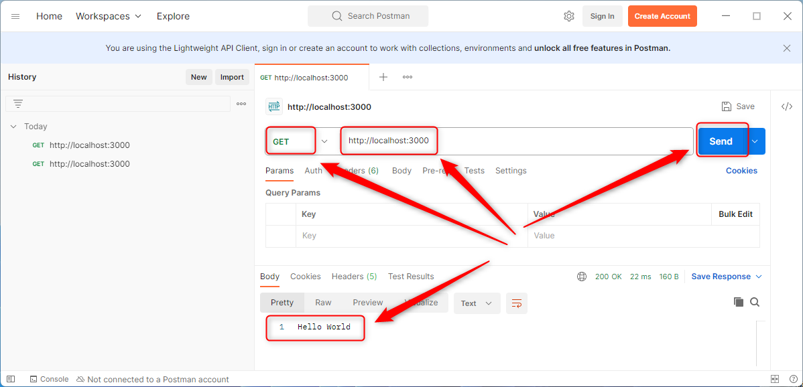

USAGE COMMANDS
--------------

> Please be aware that following tools should be installed on your local PC: **Docker**. Docker tool has to be **up and running**.

> Please **clone/download** project, open **project's main folder** in your favorite **command line tool** and then **proceed with steps below**. 

Usage steps:
1. In a command line tool start application with `docker-compose up -d --build`
1. In a http client (e.g. Postman) use **GET** method and visit `http://localhost:3000`
   * Expected **Hello World** message
1. (Optional) In a command line tool check list of all images with `docker images`
   * Expected **list of all docker images** downloaded on a computer
1. (Optional) In a command line tool check list of all containers with `docker ps -a`
   * Expected **list of all docker containers** installed on a computer
1. (Optional) In a command line tool check application logs with `docker logs ts-express-api-rest-helloworld-docker-compose-single-container`
   * Expected **application logs**
1. Clean up environment 
    * In a command line tool stop application with `docker-compose down --rmi local`

USAGE IMAGES
------------

DESCRIPTION
-----------

##### Goal
The goal of this project is to present how to **dockerize** - using **Docker Compose** tool - an application type **API REST** in **TypeScript** programming language with usage **express** framework. Dockerize means that application is installed on Docker instead directly on computer. Docker Compose tool enables orchestration of Docker containers - you can manage many Docker containers in one file and by one command.

##### Terminology
Terminology explanation:
* **TypeScript**: TypeScript is JavaScript with syntax for types.
* **API REST**: an architectural style for an application program interface (API) that uses HTTP requests to access and use data
* **Express framework**: Express.js is the most popular web framework for Node.js. It is designed for building web applications and APIs and has been called the de facto standard server framework for Node.js.
* **Docker**: this tool enables separating applications from computer. It means that instead installing application directly on computer we install them on Docker. In this way we can easly add, remove and modify any application without changing our computer system.
* **Docker Compose**: this tool enables orchestration of Docker containers. In means that you don't have to manage every Docker container one by one but you can configure them in one file and manage by one command.

##### Flow
The following flow takes place in this project:
1. User via any http client sends request to application for the content.
1. Application sends back response to user via http client with message.

##### Launch
To launch this application please make sure that the **Preconditions** are met and then follow instructions from **Usage** section.

##### Technologies
This project uses following technologies:
* **TypeScript**: `https://docs.google.com/document/d/1uSQvYyzzBnsWEbkcsSoJlK-LfTwHAvh1r2rPP0p2P78/edit?usp=sharing`
* **Node** (section 'Node'): `https://docs.google.com/document/d/1wtk8TTIDLsHSvtyUp7uCk-pOKTpmNwMANRGmBNaoBpc/edit?usp=sharing`
* **Npm** (section 'Npm'): `https://docs.google.com/document/d/1wtk8TTIDLsHSvtyUp7uCk-pOKTpmNwMANRGmBNaoBpc/edit?usp=sharing`
* **Express framework** (section 'Express Framework'): `https://docs.google.com/document/d/1wtk8TTIDLsHSvtyUp7uCk-pOKTpmNwMANRGmBNaoBpc/edit?usp=sharing`
* **Docker**: `https://docs.google.com/document/d/1tKdfZIrNhTNWjlWcqUkg4lteI91EhBvaj6VDrhpnCnk/edit?usp=sharing`
* **Docker Compose**: `https://docs.google.com/document/d/1SPrCS5OS_G0je_wmcLGrX8cFv7ZkQbb5uztNc9kElS4/edit?usp=sharing`

PRECONDITIONS
-------------

##### Preconditions - Tools
* Installed **Operating System** (tested on Windows 11)
* Installed **Docker** (tested on version 4.24.2)

##### Preconditions - Actions
* Download **Source Code** (using Git or in any other way) 
* Open any **Command Line** tool (for instance "Windonw PowerShell" on Windows OS) on downloaded **project's main folder**