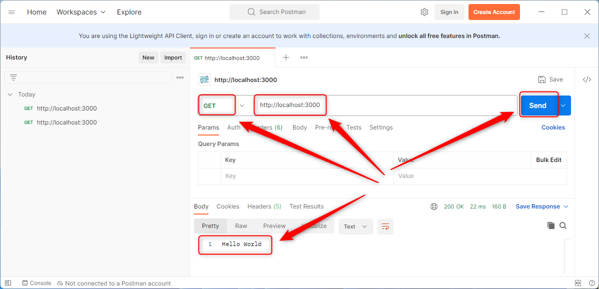

USAGE COMMANDS
--------------

> Please be aware that following tools should be installed on your local PC: **Minikube**.

> Please be aware that Kubernetes requres that **image is deployed on some Docker repository**. This example uses following image: `https://hub.docker.com/repository/docker/wisniewskikr/ts-express-api-rest-helloworld-docker-single-image/general` 

> Please **clone/download** project, open **project's main folder** in your favorite **command line tool** and then **proceed with steps below**. 

Usage steps:
1. In a command line tool (in **administrator** mode) start Minikube tool with `minikube start`
1. In a command line tool create Kubernetes elements with `kubectl apply -f kubernetes.yaml`
1. In a command line tool check Pod status with `kubectl get pod`
   * Expected **READY 1/1** and **STATUS Running** (please check it few times - it can take few minutes) 
1. In a command line tool (in **administrator** mode) open service in browser with `minikube service helloworld-service`
   * Expected **Hello World** message in a browser
1. (Optional) Check Kubernetes elements
     * In a command line tool check Hello World Deployment with `kubectl describe deployment helloworld-deployment`
     * In a command line tool check Hello World Service with `kubectl describe service helloworld-service`
1. Clean up environment 
     * In a command line tool remove Kubernetes elements with `kubectl delete -f kubernetes.yaml`
     * In a command line tool (in **administrator** mode) stop Minikube tool with `minikube stop`

USAGE IMAGES
------------

DESCRIPTION
-----------

##### Goal
The goal of this project is to present how to orchestrate Docker containers by **Kubernetes (Minikube)** tool - basing on example of an application type **API REST** in **TypeScript** programming language with usage **express** framework.

##### Terminology
Terminology explanation:
* **TypeScript**: TypeScript is JavaScript with syntax for types.
* **API REST**: an architectural style for an application program interface (API) that uses HTTP requests to access and use data
* **Express framework**: Express.js is the most popular web framework for Node.js. It is designed for building web applications and APIs and has been called the de facto standard server framework for Node.js.
* **Docker**: this tool enables separating applications from computer. It means that instead installing application directly on computer we install them on Docker. In this way we can easly add, remove and modify any application without changing our computer system.
* **Kubernetes (Minikube)**: this tool enables ochestrating Docker containers. It means that you can configure many Docker containers in one file and manage them by one Kubernetes command.

##### Flow
The following flow takes place in this project:
1. User via any http client sends request to application for the content.
1. Application sends back response to user via http client with message.

##### Launch
To launch this application please make sure that the **Preconditions** are met and then follow instructions from **Usage** section.

##### Technologies
This project uses following technologies:
* **TypeScript**: `https://docs.google.com/document/d/1uSQvYyzzBnsWEbkcsSoJlK-LfTwHAvh1r2rPP0p2P78/edit?usp=sharing`
* **Node** (section 'Node'): `https://docs.google.com/document/d/1wtk8TTIDLsHSvtyUp7uCk-pOKTpmNwMANRGmBNaoBpc/edit?usp=sharing`
* **Npm** (section 'Npm'): `https://docs.google.com/document/d/1wtk8TTIDLsHSvtyUp7uCk-pOKTpmNwMANRGmBNaoBpc/edit?usp=sharing`
* **Express framework** (section 'Express Framework'): `https://docs.google.com/document/d/1wtk8TTIDLsHSvtyUp7uCk-pOKTpmNwMANRGmBNaoBpc/edit?usp=sharing`
* **Docker**: `https://docs.google.com/document/d/1tKdfZIrNhTNWjlWcqUkg4lteI91EhBvaj6VDrhpnCnk/edit?usp=sharing`
* **Kubernetes**: `https://docs.google.com/document/d/1jOsK3Lkbkoq-Xx7Ln9o_ozCt6XpcSElOwu1o2AfQnNc/edit?usp=sharing`
* **Minikube**: `https://docs.google.com/document/d/1GfgN7tJNTIJCaSzexJdR_Lm_S9pF2YykcpgSQzAZWZo/edit?usp=sharing`

PRECONDITIONS
-------------

##### Preconditions - Tools
* Installed **Operating System** (tested on Windows 11)
* Installed **Docker** (tested on version 4.24.2)

##### Preconditions - Actions
* Download **Source Code** (using Git or in any other way) 
* Open any **Command Line** tool (for instance "Windonw PowerShell" on Windows OS) on downloaded **project's main folder**

PUSH IMAGES
-----------

> Please be aware that these steps requre created **Docker Hub** account in advence.

1. In a command line tool build Docker image with **docker build -t {docker-hub-id}/ts-express-api-rest-helloworld-docker-single-image .**. For instance with `docker build -t wisniewskikr/ts-express-api-rest-helloworld-docker-single-image .`
1. In a command line tool push Docker image with **docker push {docker-hub-id}/ts-express-api-rest-helloworld-docker-single-image**. For instance with `docker push wisniewskikr/ts-express-api-rest-helloworld-docker-single-image`